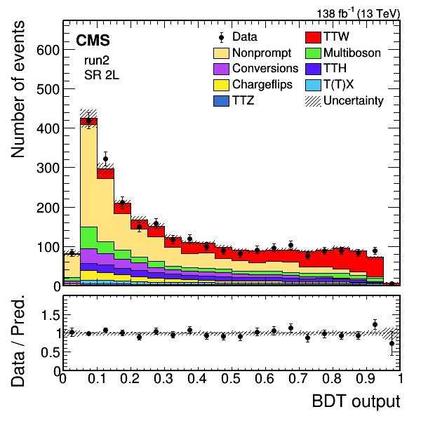

# Tools for making postfit plots

### Inputs
You will need the following inputs:
- A ROOT workspace containing all the relevant information (i.e. histograms) for the plot you want to make.
- The COMBINE datacard corresponding to that workspace (i.e. from which it was created using the `text2workspace` command).
- Optionally a fit result file (e.g. from `MultiDimFit` or `FitDiagnostics`); if not provided, prefit plots will be made.
- Optionally a `json` file with info on the variable on the x-axis, see `example_variables` for examples. This is only used for plot aesthetics (mainly formatting the x-axis) and does not impact the actual histograms.

Some example inputs are provided in `example_combine_output`:
- Datacards for the 2L signal region for each year (old iteration, just as dummy).
- Corresponding workspaces (same name but with extension `.root` instead of `.txt`).
- Files containing histograms (but not needed if you already have the workspaces).
- A fit result file `multidimfitdc_combined_signalregions_out_multidimfit_obs.root` (again, just a dummy).
And a relevant variable definition is given in `example_variables/variable_eventbdt.json`.

### How to use?
Run `python postfitplots.py -h` for a list of available options.

Example usage:
```
python postfitplots.py -w example_combine_output/datacard_signalregion_dilepton_inclusive_2018.root -d example_combine_output/datacard_signalregion_dilepton_inclusive_2018.txt -o output_test -v example_variables/variables_eventbdt.json -y run2 -r signalregion_dilepton_inclusive --fitresultfile example_combine_output/multidimfitdc_combined_signalregions_out_multidimfit_obs.root --colormap ttw --signals TTW --regroup_processes --unblind --dolog
```

If everything goes well, this should produce the following plot:



### How to modify?
The actual plotting function is in `histplotter.py`. General changes to the plotting style should be made there. However, a few options are already configurable:
- The color map for the histograms can be defined in `../plotting/colors.py` and then provided as a command line argument.
- The definition of the signal process(es), which will be put on top of the stack of histograms, can be provided as a command line argument.
- The grouping together of processes for plotting can be defined in `../plotting/regroupdicts.py` and switched on with a command line argument.
- The extra info shown on the plot for which region is being shown, and modifications to the legend entries, can be defined in `../plotting/infodicts.py`.

The scripts `postfitplots_loop.py`, `postfitplots_loopdatacards.py` and `postfitplots_makeworkspaces.py` are just utility scripts that we use to gather the correct inputs from different places in our framework; they depend a lot on custom naming conventions and ways of doing things, so they should be replaced with someting that works for your workflow (if you need them at all).
